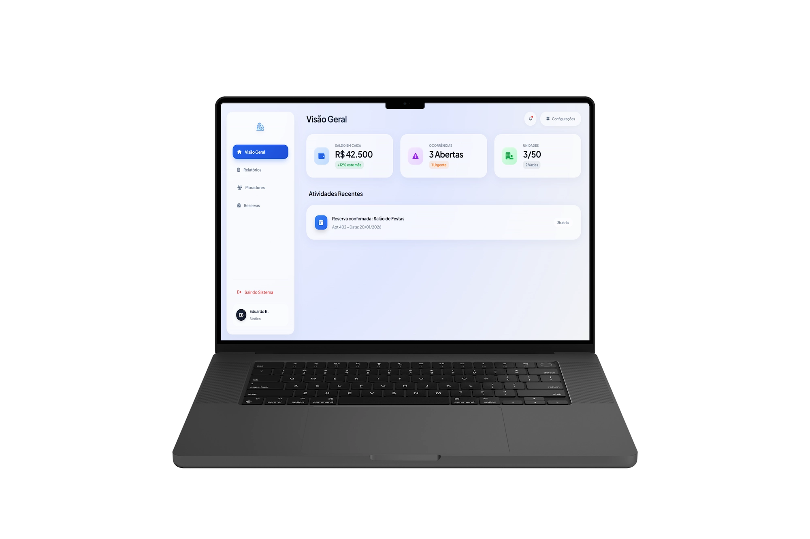

# 🏢 Condomínio App - High Performance Dashboard


> **SaaS Concept:** Uma plataforma de gestão condominial *Fullstack* focada em UX Premium (Apple-Like), performance adaptativa e atualizações em tempo real.



## ⚡ Diferenciais Técnicos (Under the Hood)

Este não é apenas um CRUD simples. A arquitetura foi desenhada para eliminar a necessidade de frameworks pesados (React/Vue), mantendo a reatividade e a performance no talo.

### 1. 🚀 Motor de Performance Adaptativo (`performance.js`)
O sistema detecta automaticamente a capacidade do hardware do usuário:
* Executa testes de **FPS** no carregamento.
* Monitora núcleos de CPU e memória do dispositivo.
* **Low-End Devices:** Desativa automaticamente filtros pesados (`backdrop-filter`, `blur`) e simplifica animações CSS para garantir 60fps constantes, mesmo em batatas.

### 2. 🧠 Gerenciamento de Estado & Cache (Vanilla Store)
Implementação de uma *Store* centralizada no `dashboard.js` sem dependências externas:
* **Smart Caching:** Dados (moradores, reservas) possuem `CACHE_TTL` (Time-to-Live). O sistema só busca no banco se o cache expirar, economizando requisições (Read Ops).
* **Otimistic UI:** A interface reage instantaneamente às ações do usuário enquanto processa o backend.

### 3. 📡 Realtime via WebSockets
Integração profunda com o **Supabase Realtime**. O Dashboard não precisa de *refresh*:
* Novas ocorrências "pipocam" na tela de todos os admins conectados.
* O status do Caixa é atualizado globalmente no milissegundo que uma movimentação ocorre.

---

## 🛠️ Stack Tecnológica

A "Tríade Web" levada ao extremo, apoiada por infraestrutura Serverless.

| Camada | Tecnologia | Detalhes |
| :--- | :--- | :--- |
| **Frontend** | HTML5, CSS3, ES6+ | Módulos JS nativos, CSS Variables, Apple Physics Easing. |
| **Backend** | Supabase (BaaS) | Postgres, Auth, Edge Functions, RPCs. |
| **Segurança** | RLS (Row Level Security) | Políticas estritas no banco. Moradores veem apenas seus dados; Admins veem tudo. |
| **Assets** | FontAwesome 6 | Ícones vetoriais otimizados. |

---

## 💎 Features & Arquitetura Visual

### Design System (Apple Physics)
O CSS (`global.css`) utiliza curvas de Bézier customizadas (`--ease-spring`, `--ease-snappy`) para replicar a física de interfaces nativas do iOS/macOS.
* **Glassmorphism 2.0:** Painéis com desfoque de fundo e saturação (saturate 180%) para legibilidade perfeita.
* **Temas:** Suporte nativo a **Dark/Light Mode** com persistência em `localStorage`.

### Módulos do Sistema
1.  **Dashboard Financeiro:** KPIs de caixa com extrato público transparente.
2.  **Central de Reservas:** Validação de conflito de horários direto no banco de dados.
3.  **Livro de Ocorrências:**
    * Fluxo: Abertura (Morador) -> Análise (Síndico) -> Resolução.
    * Permissões granulares para exclusão.
4.  **Gestão de Moradores:**
    * Cadastro com verificação de unidade duplicada.
    * Gerador automático de avatares (UI Avatars) ou upload de URL.
    * **Secure Delete:** Função RPC para limpeza completa de dados de autenticação e perfil.

---

## 📂 Estrutura do Projeto

```text
/
├── src/
│   ├── about/          # Landing Page Institucional (Dock Navigation)
│   ├── auth/           # Fluxo Completo (Login, Register, Recovery, Magic Link)
│   ├── dashboard/      # Core Application
│   │   ├── dashboard.html  # Layout Modular
│   │   ├── dashboard.js    # State Management & Business Logic
│   │   └── theme.js        # Theme Switcher Logic
│   ├── services/       # Camada de API (Supabase Client Singleton)
│   ├── imagens/        # WebP Assets Otimizados
│   ├── global.css      # Design Tokens & CSS Reset
│   ├── index.html      # Landing Page
│   └── performance.js  # Hardware Detection Engine
└── README.md           # Documentação
```
<br>

<div align="center">

Developed by Eduardo Bruscagim Fullstack Engineering & Product Design

</div>